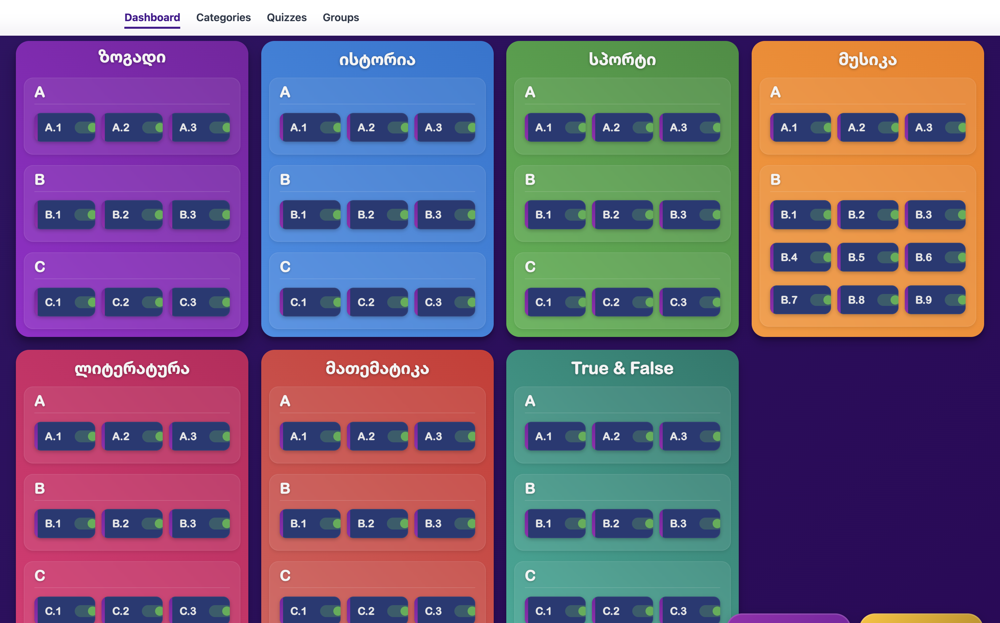
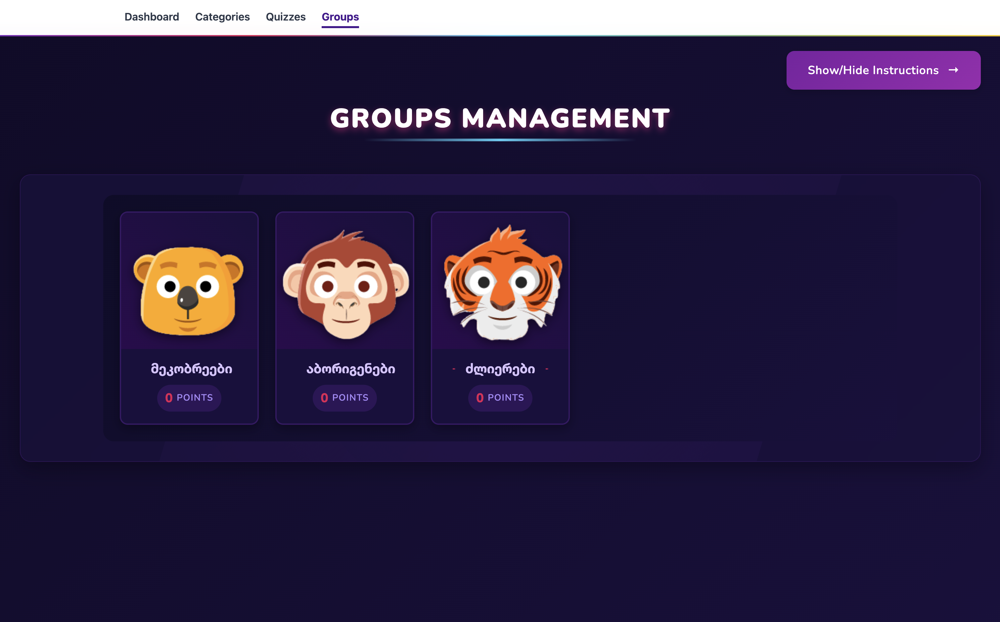
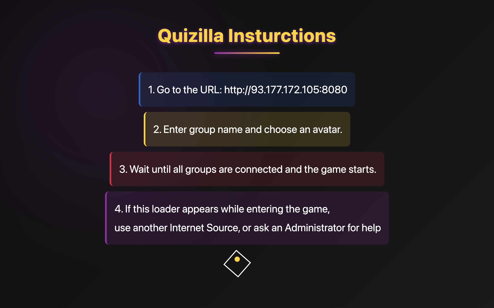
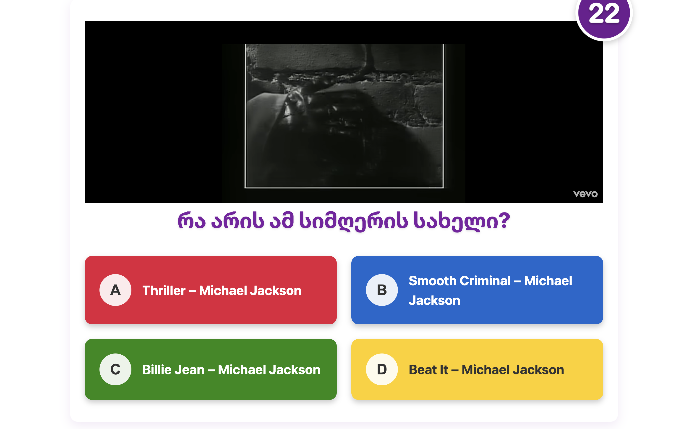
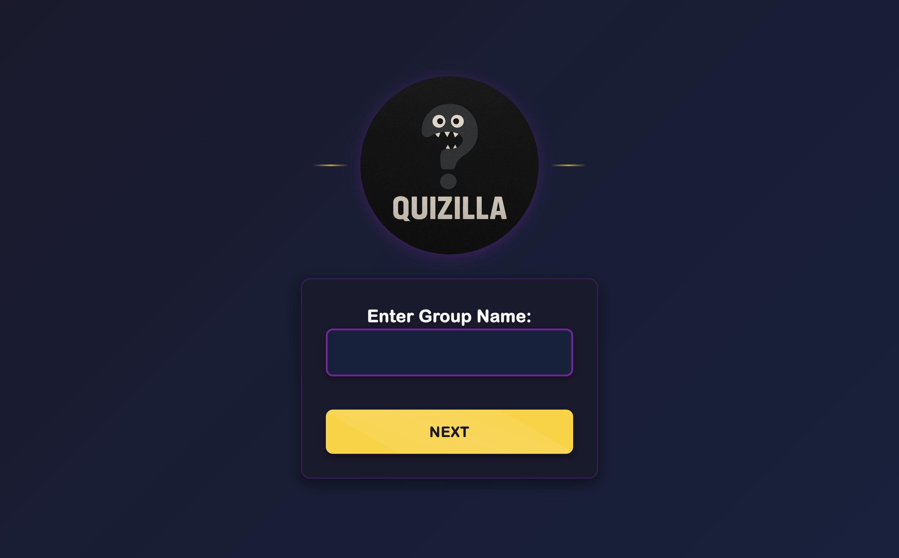
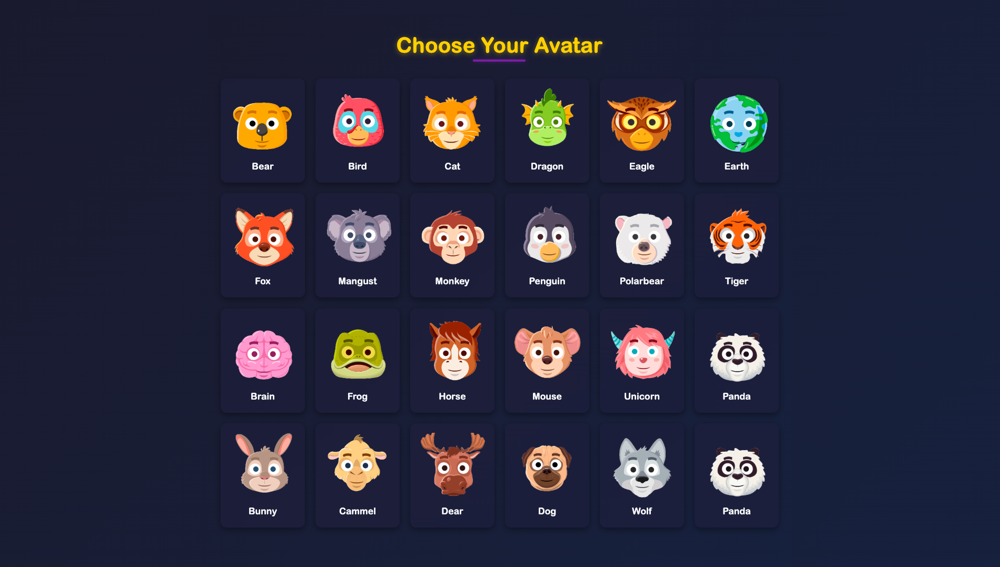

# 🎉 Quizilla! - The Ultimate Multiplayer Quiz Experience 🧠

Welcome to **Quizilla!** — a fun, colorful, and interactive quiz game built to engage, challenge, and entertain! Whether you're a teacher, event host, or trivia lover, Quizilla is your go-to platform for real-time multiplayer quizzing.

---

## 🚀 Features

- 🔢 **Multiple Question Types** – Multiple choice, true/false, and more!
- 🧑‍🤝‍🧑 **Multiplayer Ready** – Join with a group, choose your avatar, and battle it out!
- 🎥 **Projector Mode** – Display questions and podiums live in real-time.
- 🔌 **WebSocket Integration** – Lightning-fast responses for real-time gameplay.
- 🎨 **Stylish Interface** – Neon-inspired modern UI with light/dark mode support.
- 💾 **Admin Panel** – Manage questions, categories, and game settings with ease.
- 📺 **Video Support** – Embed YouTube videos into questions for more interactive quizzes.
- 📊 **Dynamic Scoring System** – Points based on response time and difficulty.

---

## 🖥️ Tech Stack

- **Frontend:** React, SCSS, WebSockets
- **Backend:** Spring Boot (Java)
- **Database:** MySQL
- **Others:** Axios, React Router, Styled Components

---

### Backend (Spring Boot)
Repository: [Quizilla-Back](https://github.com/Daniel160407/Quizilla-Back)

## Screenshots

